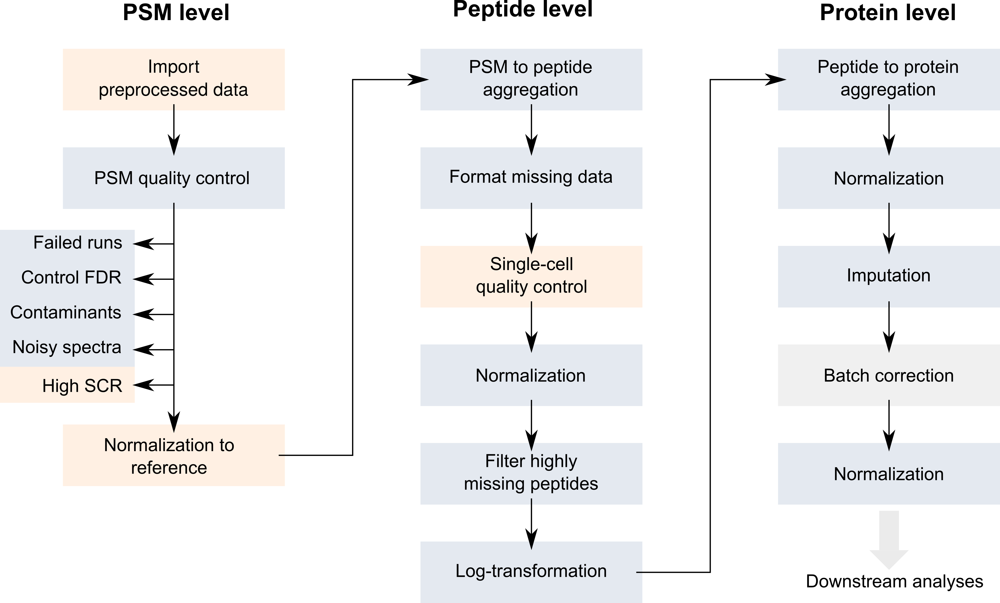

```{r style, echo = FALSE, results = 'asis', message = FALSE}
library(BiocStyle)
knitr::opts_chunk$set(echo = TRUE,
                      message = FALSE,
                      collapse = TRUE)
```


```{r packages, echo = FALSE, results = 'asis', message = FALSE}
library(scp)
library(scpdata)
library(sva)
library(tidyverse)
```

**Last modified:** `r file.info("v02-scp.Rmd")$mtime`<br />
**Compiled**: `r date()`

# Introduction

Mass spectrometry (MS)-based single-cell proteomics (SCP) is emerging
thanks to several recent technological advances in sample preparation,
liquid chromatography (LC) and MS (see @Kelly2020-xd for a 
comprehensive review). The improvements tackle the issues encountered
when dealing with small sample amounts and focus on: 

* Reducing sample loss
* Increasing sensitivity and quantification accuracy
* Increasing acquisition throughput

Two main strategies have currently been developed. On the one hand,
label-free protocols acquire one single cell per MS run leading to 
accurate quantification but low sensitivity and throughput. On the 
other hand, label-based protocols multiplex several single-cell samples 
in one MS run leading to higher throughput (1000 cells per week). 
Another advantage of label-based protocols is the inclusion of a 
carrier sample, that is a sample containing between tens to hundreds 
of cells. Including a carrier increases sensitivity thanks to 
increased sample material, but at the cost of decreased quantification
accuracy due to chemical noise (linked to sample labelling) and
competition between the single-cell samples and the carrier sample 
during MS acquisition.

Although the `scp` package can handle the data acquired from the two 
strategies, the exercise of this vignette will focus on the 
multiplexed strategy developed by @Specht2021-jm, called SCoPE2. An
overview of the acquisition and data processing pipeline is depicted
below. 

```{r pipeline, fig.cap = "Main steps of the SCoPE2 data acquisition and processing pipeline.", echo = FALSE, out.width="80%"}
knitr::include_graphics("figs/SCoPE2_pipeline.png")
```

# The `scp` data framework

SCP data is very similar to bulk proteomics data with the exception 
that the PSM data may be composed of tens to hundreds of separate 
acquisition runs. The `QFeatures` class is able to store this 
acquisition structure by considering each MS run as a separate assay.
Because the assays hold information about single cells, they are 
stored as `SingleCellExperiment` objects (@Lun2020-cv) to create a
direct interface to existing Bioconductor packages. Performing 
downstream analyses (such as dimension reduction, clustering, finding
markers) very easy. The links between related features across 
different assays are also stored to facilitate manipulation and 
visualization of of PSM, peptide and protein data as we go along with
the processing workflow. 

```{r featuresplot, fig.cap = "Conceptual overview of a `QFeatures` object containing SCP data. Each assay is stored as a `SingleCellExperiment` object.", echo = FALSE, out.width="80%"}
knitr::include_graphics("figs/SCP_framework.png")
```


# The `scp` package

The general workflow for processing SCP data is very similar to the 
workflow for bulk proteomics that we presented in the previous 
vignette. Therefore, the `QFeatures` package already contains most of 
the tools required for the processing of SCP data. The `scp` package
implements the missing functions that are specifically designed for 
dealing with SCP data. Below, we provide the list of functions from
`scp` that extend the `QFeatures` functions:

- `readSCP`: this is the main feature of the `scp` package. It loads 
and formats standard data tables into `QFeatures` objects ready for
data processing.
- `aggregateFeaturesOverAssays`: extends `aggregateFeatures` to allow
streamlined aggregation over multiple assays
- `computeSCR`: compute the sample over carrier ratio (SCR), a useful
metric for feature QC
- `divideByReference`: divide columns by a reference column
- `medianCVperCell`: compute the median coefficient of variation (CV) 
per cell, a useful metric for single-cell QC
- `normalizeSCP`: extends `QFeatures::normalize` to `SingleCellExperiment` 
objects
- `pep2qvalue`: compute q-values from posterior error probabilities
- `rowDataToDF`: extract the `rowData` of a `QFeatures` object to a
`DataFrame`

You will be able to test those functions in the **exercise** later in 
this vignette. 

# Load SCP data

There are two input tables required for starting an analysis with 
`scp`:

1. The feature data
2. The sample data

## Feature data

The feature data are generated after the identification and 
quantification of the MS spectra by a pre-processing software such as
MaxQuant, ProteomeDiscoverer or MSFragger (the 
[list](https://en.wikipedia.org/wiki/List_of_mass_spectrometry_software)
of available software is actually much longer). We will here use as an
example a data table that has been generated by MaxQuant. The table is
available from the `scp` package and is called `mqScpData` (for 
MaxQuant-generated SCP data). 

```{r, message = FALSE}
library(scp)
data("mqScpData")
dim(mqScpData)
```

In this toy example, there are 1361 rows corresponding to features 
(quantified PSMs) and 149 columns corresponding to different data 
fields recorded by MaxQuant during the processing of the MS spectra. 
The columns can be divided into three categories: 

- Columns holding feature quantifications
- Columns holding feature metadata
- Columns holding MS run metadata

### Feature quantifications

The quantification data can be composed of one (in case of label-free
acquisition) up to 16 columns (in case of TMT-16 multiplexing). The 
columns holding the quantification start with `Reporter.intensity.`
followed by a number. 

```{r}
(quantCols <- grep("Reporter.intensity.\\d", colnames(mqScpData), value = TRUE))
```

As you may notice, the example data was acquired using a TMT-16 
protocol since we retrieve 16 quantification columns. Actually, some 
runs were acquired using a TMT-11 protocol (11 labels) but we will 
come back to this later. 

```{r}
head(mqScpData[, quantCols])
```

### Feature metadata

Most columns in the `mqScpData` table contain information used or 
generated during the identification of the MS spectra. For instance, 
you may find the charge of the parent ion, the score and probability 
of a correct match between the MS spectrum and a peptide sequence, the
sequence of the best matching peptide, its length, its modifications,
the retention time of the peptide on the LC, the protein(s) the peptide
originates from and much more. 

```{r}
head(mqScpData[, c("Charge", "Score", "PEP", "Sequence", "Length",
                   "Retention.time", "Proteins")])
```

### MS run metadata

This type of metadata is related to the MS instrument. In MaxQuant, 
only the file name generated by the MS instrument is stored. There is 
one file for each MS run, hence the file name can be used as a batch 
identifier.

```{r}
unique(mqScpData$Raw.file)
```

The 1361 PSM were found across 4 MS runs. While these 4 runs are 
contained in a single table, we will split them in separate assay when
building the `QFeautres` object. 

## Sample data

Next to the quantification data and the feature data, sample metadata 
contains the experimental design generated by the researcher. The 
rows of sample metadata correspond to a sample in the experiment and 
the columns correspond to the available information about the sample.
We will here use the second example table provided in `scp`:

```{r}
data("sampleAnnotation")
head(sampleAnnotation)
```

This table may contain any information about the samples. For example,
useful information could be the type of sample that is analysed, an 
*apriori* known phenotype, the MS batch, the acquisition date, MS 
settings used to acquire the sample, the LC batch, the sample 
preparation batch, ... `scp` **requires** 2 specific fields in the sample metadata:

1. One column containing the MS run names (`Raw.file` in this case). 
It must have the same name as the name of the column containing the 
MS run names in the quantification table. This will allow `scp` to 
correctly match and split data that were acquired separately. This 
is illustrated below by the linked circles.
2. One column that tells `scp` which column in the feature data holds
the quantification of the corresponding sample. This is illustrated
below by the arrow.

```{r, fig.cap = "Linking the sample data to the feature data.", echo = FALSE, out.width="50%"}
knitr::include_graphics("figs/readSCP_relation.png")
```

## `readSCP`

`readSCP` is the function that converts the sample and the feature 
data into a `QFeatures` object following the data structure described
above, that is storing the data belonging to each MS batch in a 
separate `SingleCellExperiment` object. We therefore provide the 
feature data, the sample data to the function as well as the name of 
the column that holds the batch name in both tables and the name of 
the column in the sample data that points to the quantification 
columns in the feature data. We also add an (optional) suffix
to the sample names to remind that samples were labelled using 16 
different TMT. Finally, another optional argument is to remove empty 
samples (`removeEmptyCols = TRUE`). We do this because one run was 
acquired using TMT-16 and the three other runs were acquired using 
TMT-11, meaning that the quantification columns for labels 12 to 16 
are empty for all except one batch.

```{r readSCP, message = TRUE}
scp <- readSCP(featureData = mqScpData,
               colData = sampleAnnotation,
               batchCol = "Raw.file",
               channelCol = "Channel",
               suffix = paste0("_TMT", 1:16),
               removeEmptyCols = TRUE)
```

As prompted by the function, the feature data is converted to a 
`SingleCellExperiment` object then split according to the batch 
structure. This means that we should have as many assays than batches:

```{r overview}
scp
```

Indeed, we can see that the object returned by `readSCP` is a 
`QFeatures` object containing 4 `SingleCellExperiment` assays that have
been named after the 4 MS batches. Each assay contains either 11 or 16
columns (samples) depending on the TMT labelling strategy and a
variable number of rows (quantified PSMs). Each piece of information 
can easily be retrieved thanks to the `Qfeatures` architectures.
As mentioned in the previous vignette, sample data is retrieved from 
the `colData`. Note that unique sample names were automatically 
generated by combining the batch name and the suffix provided to 
`readSCP`:

```{r colData}
colData(scp)
```

The feature metadata is retrieved from the `rowData`. Since the 
feature metadata is specific to each assay, we need to tell from which 
assay we want to get the `rowData`:

```{r rowData}
rowData(scp[["190222S_LCA9_X_FP94BM"]])[, 1:5]
```

Finally, we can also retrieve the quantification matrix for an assay
of interest:

```{r assay}
assay(scp, "190222S_LCA9_X_FP94BM")[1:5, 1:5]
```

# The `scpdata` package

Next to `scp`, we also developed `scpdata`, a data package that 
disseminates published SCP data sets formatted using the `scp` data 
structure. The package heavily relies on the 
[`ExperimentHub`](https://bioconductor.org/packages/release/bioc/html/ExperimentHub.html) 
infrastructure. This package is an ideal platform for data sharing and
promotes for open and reproducible science in SCP, it facilitates the
access for developers to SCP data to build and benchmark new 
methodologies and it facilitates the access for new users to data in 
the context of training and demonstration (like this workshop).

After loading the package, you can have a look at the available 
datasets by running: 

```{r scpdata, message = FALSE}
library(scpdata)
scpdata()
```

For instance, loading the data sets published in @Zhu2019-ja is as 
simple as calling the title of the data set:

```{r}
zhu2019EL()
```


# Reproduce a published analysis

As a use-case, we will reproduce the analysis of the SCoPE2 data 
published in @Specht2021-jm. SCoPE2 is the first published SCP 
protocol that has been used to profile thousands of proteins in 
thousands of single-cells. This is a technical milestone for the field
and it opens the door for a fine-grain understanding of biological 
processes at the protein level. 

Along their acquisition protocol, the authors have also provided an 
[R script](https://github.com/SlavovLab/SCoPE2/blob/8780805f69f7547a2f3b592d3614b649179dfc4e/code/SCoPE2_analysis.R) 
to reproduce their data processing. The code is hard to read and built
from scratch. We have used `scp` to standardize this workflow 
(@Vanderaa2021-xd) and reproduce the results using code that can 
easily be adapted to other data sets. The outline of the workflow is 
shown below. 

```{r SCoPE2_workflow, fig.cap = "Workflow describing the main steps performed by Specht et al. to process the SCP data. Figure taken from @Vanderaa2021-xd", echo = FALSE, out.width="80%"}

```

The replication analysis on the full data set is provided in 
[another vignette](https://uclouvain-cbio.github.io/SCP.replication/articles/SCoPE2.html).

## Import the data

In a previous section we have shown how to format the feature and
sample tables to a `Qfeatures` object for a small subset of the SCoPE2
data set. We will here import the data directly from `scpdata` to gain
some time.

```{r SCoPE2_data}
(scp <- specht2019v3())
```

The data set provides 177 assays containing the PSM data, but also two
assays that contain the peptide and protein data generated by the 
authors in the original work. 

First, to reduce the computational burden we will focus on part of the 
data. The samples that were acquired in 4 chromatographic batches and
we will run this example on the batch called (`LCB3`).  

```{r}
scp <- scp[, , grepl("LCB3", names(scp))]
```

## Before starting the exercise

The remainder of the vignette includes a few exercises for you to have
your hands on the functions in `QFeatures` and `scp`. We have hidden 
the solution under `Solution` ticks that you can click on to reveal 
a good answer (sometimes, several solution are possible but we 
provided only one). 

**Important**: while experimenting with the package, you might cause 
unwanted changes to your data. To avoid running the whole script at 
every mistake, we recommend you to save the data in a temporary 
variable before every exercise. For example: 

```{r}
tmp <- scp
```

As soon as you realize you made undesired changes, you can quickly 
revert to the previous state of the data by running 

```{r}
scp <- tmp
```

## PSM quality control

This section will guide you through the filtering of low-quality 
features based on different metrics.

### Filter out failed runs based on PSM content

First, only the assays that have sufficient PSMs are kept. The authors
keep an assay if it has over 500 PSMs. Before filtering, let's first
look at the distribution of the number of PSMs per assay. 

**Exercise**: Extract the number of rows (here PSMs) and the number of
columns (TMT channels) of each assay using the `dims` function
implemented in `QFeatures`.

<details><summary>Solution</summary>
```{r dims}
nPSMs <- dims(scp)[1, ]
```
</details>
<br>

Let's have a look at the number of features that were identified in
the different runs. The data visualization in this vignette is 
performed using the `ggplot2` function. 

```{r plot_dims}
library("ggplot2")
ggplot(data.frame(nPSMs)) +
    aes(x = nPSMs) +
    geom_histogram() +
    geom_vline(xintercept = 500)
```

No MS run failed in the LB3 batch. If some runs had failed, we could
have subsetted the data taking advantage of the subsetting
method of a `QFeatures` object.

```{r remove_failed_runs, eval=FALSE}
scp <- scp[, , nPSMs > 500]
```

### Filter out PSMs with high false discovery rate

Next, the SCoPE2 workflow filters PSMs based on the false discovery
rate (FDR) for identification. This will remove the PSMs that were 
matched by chance. The PSM data were already processed with DART-ID
(@Chen2019-uc), a python software that updates the confidence in 
peptide identification using an Bayesian inference approach. DART-ID 
outputs for every PSM the updated posterior error probability (PEP).
Filtering on the PEP is too conservative and it is rather advised to 
filter based on FDR (@Kall2008-hb). To control for the FDR, we need to
compute q-values, that correspond to the minimal FDR threshold that 
would still select the associated feature.

You can use the `pep2qvalue` function to easily compute q-values from 
the PEPs computed by MaxQuant or updated by DART-ID. In the SCoPE2
workflow, the features are selected based on the FDR at PSM level and
at protein level. We here show to convert the PEP to q-values at PSM
level. The DART-ID PEPs (`dart_PEP`) are automatically retrieved from
the `rowData` of each assay. The function will store the computed 
q-values back in the `rowData` under `qvalue_psm`.

```{r}
scp <- pep2qvalue(scp,
                  i = names(scp),
                  PEP = "dart_PEP",
                  rowDataName = "qvalue_psm")
```

**Exercise**: Try it yourself and convert the PEPs to protein-level 
q-values. Note that you will need to group the features by the protein
identifiers in order to compute the q-values at proteins level. 

<details><summary>Hint1</summary>
Check the documentation (`?pep2qvalue`) and look for the `groupBy` 
argument.  
</details>

<details><summary>Hint2</summary>
Use `rowDataNames` on the `QFeatures` object to list all 
available grouping variables.
</details>

<details><summary>Hint2</summary>
If you run into errors, make sure to change the name of the `rowData` 
variable to something like `qvalue_protein`. 
</details>

<details><summary>Solution</summary>
```{r}
scp <- pep2qvalue(scp,
                  i = names(scp),
                  groupBy = "protein",
                  PEP = "dart_PEP",
                  rowDataName = "qvalue_protein")
```
</details>
<br>

You can extract the q-values from the `rowData` of several assays using
the `rbindRowData` function. It takes the `rowData` of interest and
returns a single `DataFrame` table with all common variables. Let's plot
the q-values along with the DART-ID PEPs using `ggplot2` facets. 

```{r qvalue_plot, message=FALSE}
rbindRowData(scp, i = names(scp)) %>%
    data.frame %>%
    pivot_longer(cols = c("dart_PEP", "qvalue_psm", "qvalue_protein"),
                 names_to = "measure") %>%
    ggplot(aes(x = value)) +
    geom_histogram() +
    geom_vline(xintercept = 0.1) +
    scale_x_log10() +
    facet_grid(rows = vars(measure))
```

Filtering out low-confidence PSMs is performed using the 
`filterFeatures` function. The SCoPE2 authors removed features so to
control a 1% PSM and protein FDR. 

**Exercise:** Keep only PSMs that have a PSM q-values **and** protein
q-values lower than 0.01.

<details><summary>Solution</summary>
```{r filter_FDR}
scp <- filterFeatures(scp,
                      ~ qvalue_psm < 0.01 & qvalue_protein < 0.01)
```
</details>

### Filter out contaminants

All MS-based proteomic experiment is subjected to contamination from 
the environment. The most common contamination is keratin released from
the researcher's skin. A small database of known contaminants is commonly 
supplied to tag PSMs originating from potential contaminants. Next to
that, a decoy database consisting of reversed peptide sequence is used
to assess the reliability of the PSM identification and tag false hits.

**Exercise**: remove the PSMs that were matched to contaminant 
proteins (the protein name starts with `CON`) or to the decoy database
(the protein name starts with `REV`). Again, `filterFeatures` can 
directly access the protein names from the `rowData`.

<details><summary>Hint1</summary>
Remember the `rowData` column holding the protein names is called 
`protein`. You can have a quick look at all protein names using 
`rbindRowData(scp)$protein`.
</details>

<details><summary>Hint2</summary>
You can use the `grepl` function to match protein identifiers with the
pattern of interest (`REV|CON` in this case). 
</details>

<details><summary>Solution</summary>
```{r filter_contaminants}
scp <- filterFeatures(scp,
                      ~ !grepl("REV|CON", protein))
```
</details>

### Filter out noisy spectra

A PIF (parental ion fraction) smaller than 80 \% indicates the
associated spectra is contaminated by co-isolated peptides and
therefore the quantification becomes unreliable. The PIF was computed
by MaxQuant and is readily available for filtering. 

**Exercise**: Keep only PSMs that have low spectral contamination, 
that is, PSMs with an associated PIF greater than 0.8. 

<details><summary>Solution</summary>
```{r filter_PIF}
scp <- filterFeatures(scp,
                      ~ !is.na(PIF) & PIF > 0.8)
```
</details>

### Filter out PSMs with high sample to carrier ratio

The SCoPE2 authors suggested in their paper a new QC metric for SCP 
data, the sample to carrier ratio (SCR). The SCR is the TMT ion 
intensity of a single-cell sample divided by the TMT ion intensity of
the carrier (200 cells) acquired during the same run as the sample. It
is expected that the carrier intensities are much higher than the 
single-cell intensities. The `scp` package offers the `computeSCR` 
function that computes the SCR for each PSM averaged over all samples 
of interest in a given assay. To perform this, you need to tell the
function which columns are the samples of interest and which columns 
are the carriers. The `colData` of the `QFeatures` object is used 
to define this.

```{r}
table(scp$SampleType)
```

In this dataset, `SampleType` gives the type of sample that is present
in each TMT channel. The SCoPE2 protocol includes 5 types of samples:

* The carrier channels (`Carrier`) contain 200 cell equivalents and
are meant to boost the peptide identification rate.
* The normalization channels (`Reference`) contain 5 cell equivalents
and are used to partially correct for between-run variation.
* The unused channels (`Unused`) are channels that are left empty due
to isotopic cross-contamination by the carrier channel.
* The blank channels (`Blank`) contain samples that do not contain any
cell but are processed as single-cell samples.
* The single-cell sample channels contain the single-cell samples of
interest (`Macrophage` or `Monocyte`).

The `computeSCR` function expects the user to provide a pattern
(following regular expression syntax) that identifies a carrier 
channel in each run and the samples. The function will store the 
computed SCR of each feature in the `rowData` of the corresponding
assay. When multiple matches are found for samples or carrier, you 
should also provide a summarizing function through `sampleFUN` and 
`carrierFUN` respectively.

**Exercise**: Compute the SCR by considering blanks, monocytes and 
macrophages as samples of interest. Note there are therefore multiple
samples per run for each PSM. You should compute the mean of the 
samples. There is only a single carrier, so you don't need to bother 
providing `carrierFUN`. The SCR is stored in the `rowData`, call the 
new variable 

<details><summary>Hint</summary>
Remember that the sample types are available from the `colData` column
`SampleType`. The output above provides an overview of the available
sample types in the data.
</details>

<details><summary>Solution</summary>
```{r computeSCR}
scp <- computeSCR(scp,
                  i = names(scp),
                  colvar = "SampleType",
                  carrierPattern = "Carrier",
                  samplePattern = "Blank|Monocyte|Macrophage",
                  sampleFUN = mean,
                  rowDataName = "MeanSCR")
```
</details>

Before applying the filter, let's plot the distribution of the mean SCR.

```{r meanSCR_plot, warning=FALSE, message=FALSE}
rbindRowData(scp, i = names(scp)) %>%
    data.frame %>%
    ggplot(aes(x = MeanSCR)) +
    geom_histogram() +
    geom_vline(xintercept = c(1/200, 0.1),
               lty = 2:1) +
    scale_x_log10()
```

A great majority of the PSMs have a mean SCR that is lower than 10\%,
as expected. Interestingly, the mode of the distribution is located 
close to 1\%. This is expected since every sample channel contains a
single-cell and the carrier contains 200 cells leading to an expected
ratio of 0.5\% (dashed line). 

Note that some of the SCR values are missing (when quantification data
are missing or when dividing zero by zero) or are infinite (when 
carrier is zero but not samples). The features associated to those 
artefacts are removed as well.

**Exercise**: remove the PSMs for which the mean SCR exceeds the 10\%
threshold. Make sure also to remove mean SCR values that are `NA` or
infinite. 

<details><summary>Hint</summary>
You can check whether the mean SCR is NA using `is.na(MeanSCR)`, and 
similarly `is.infinite(MeanSCR)` for infinite values. 
</details>

<details><summary>Solution</summary>
```{r}
scp <- filterFeatures(scp,
                      ~ !is.na(MeanSCR) &
                          !is.infinite(MeanSCR) &
                          MeanSCR < 0.1)
```
</details>

## Normalization to reference

In order to partially correct for between-run variation, the SCoPE2 
authors compute relative reporter ion intensities. This means that
intensities measured for single-cells are divided by the reference
channel (5-cell equivalents). You can use the `divideByReference`
function that divides channels of interest by the reference channel.
Similarly to `computeSCR`, you can point to the samples and the
reference columns in each assay using the annotation contained in the
`colData`. 

**Exercise**: divide all columns by the reference channel using 
`divideByReference`.

<details><summary>Hint</summary>
You can use the regular expression wildcard `.` to select all columns.
</details>

<details><summary>Solution</summary>
```{r}
scp <- divideByReference(scp,
                         i = names(scp),
                         colvar = "SampleType",
                         samplePattern = ".",
                         refPattern = "Reference")
```
</details>

Notice that by taking all samples you also included the reference
channel itself. Hence, from now on, the reference channels will 
contain only ones. This is how it was done in the SCoPE2 paper, but 
for later analysis, we advice to use a pattern that matches only the 
single-cell columns. 

## PSM to peptide aggregation

Now that the PSM assays are processed, you can aggregate them to
peptides. This is performed using the `aggregateFeaturesOverAssays`
function. This is a wrapper function in `scp` that sequentially calls
the `aggregateFeatures` from the `QFeatures` package over the
different assays. For each assay, the function aggregates several PSMs
into a unique peptide given an aggregating variable in the `rowData`
(peptide sequence) and a user-supplied aggregating function (the
median for instance). Regarding the aggregating function, the SCoPE2
analysis removes duplicated peptide sequences per run by taking the
first non-missing value. While better alternatives are documented in
`QFeatures::aggregateFeatures`, we suggest to use this approach for the
sake of replication, but also to illustrate that custom functions can
be applied when aggregating.

```{r remove.duplicates}
remove.duplicates <- function(x)
    apply(x, 2, function(xx) xx[which(!is.na(xx))[1]] )
```

For each assay, a new aggregated assay will be added to the dataset.
The aggregated peptide assays must be given a name. We here suggest to
use the original names prefixed with `peptides_`.

```{r peptideAssays}
peptideAssays <- paste0("peptides_", names(scp))
```

You now have all the required information to aggregate the PSMs in the
different batches to peptides. 

**Exercise**: use the `aggregateFeaturesOverAssays` function to 
aggregate PSMs to peptides. Don't forget to provide the 
`remove.duplicates` as an aggregating function. 

<details><summary>Hint</summary>
You should aggregate PSMs to peptides. So, you can group the PSMs
by supplying `fcol = "peptide"`. The function will take the `peptide`
column in the `rowData` that contains the peptide sequences and create
a new aggregated feature for each unique sequence. 
</details>

<details><summary>Solution</summary>
```{r, message = FALSE}
scp <- aggregateFeaturesOverAssays(scp,
                                   i = names(scp),
                                   fcol = "peptide",
                                   name = peptideAssays,
                                   fun = remove.duplicates)
```
</details>

Under the hood, the `QFeatures` architecture preserves the
relationship between the aggregated assays. See `?AssayLinks` for more
information on relationships between assays. Notice that
`aggregateFeaturesOverAssays` created as many new assays as the number
of supplied assays.

```{r overview2}
scp
```

You can also have a graphical overview of the assay relationships 
thanks to the `plot` function. Since many assays are present, we 
suggested to enable the interactive viewer for you to explore the plot. 

```{r, eval = FALSE}
plot(scp, interactive = TRUE)
```

## Cleaning missing data

The next step is to replace zero and infinite values by `NA`s. The 
zeros can be biological zeros or technical zeros and differentiating 
between the two types is a difficult task, they are therefore better 
considered as missing data that should be modelled using dedicated 
methods. The infinite values appear during the normalization by the 
reference when the reference channel is zero. This artefact could 
easily be avoided if we had replaced the zeros by `NA`s at the 
beginning of the workflow, what we strongly recommend for future 
analyses.

The `infIsNA` and the `zeroIsNA` functions automatically detect
infinite and zero values, respectively, and replace them with `NA`s.
Those two functions are provided by the `QFeatures` package. See here
how you can replace infinite values by NA:

```{r}
sum(is.infinite(assay(scp, peptideAssays[1])))
scp <- infIsNA(scp, i = peptideAssays)
sum(is.infinite(assay(scp, peptideAssays[1])))
```

**Exercise**: your turn, replace all zero values by NA. 

<details><summary>Solution</summary>
```{r}
sum(assay(scp, peptideAssays[1]) == 0, na.rm = TRUE)
scp <- zeroIsNA(scp, i = peptideAssays)
sum(assay(scp, peptideAssays[1]) == 0, na.rm = TRUE)
```
</details>

## Join the peptide assays in one assay

Up to now, the data belonging to each MS run are kept in separate
assays. You can combine all batches into a single assay using the 
`joinAssays` function from the `QFeatures` package.

**Exercise**: use `joinAssays` to combine all peptide assays in a 
single assay. Recall that we already stored the peptide assay names 
in a variable, `peptideAssays`. 

<details><summary>Solution</summary>
```{r join_assays}
scp <- joinAssays(scp,
                  i = peptideAssays,
                  name = "peptides")
```
</details>

Note `joinAssays` has created a new assay called `peptides` that 
combines the previously aggregated peptide assays.

```{r overview3}
scp
```

At this point, you can regularly have a look at `plot(scp, interactive = TRUE)`
to keep an overview of the assay hierarchy. 

## Single-cell quality control

The SCoPE2 workflow proceeds with the filtering of low quality cells. 
The filtering is based on the median coefficient of variation (CV)
per cell. The CV is measured for each protein in each sample as the 
standard deviation of the corresponding peptides divided by the average 
expression of those peptides. Taking the median CV per cell will give 
a measure of the consistency of the quantification within that cell.
We want to remove cells that exhibit a high median CV because 
inconsistent measure imply artefacts during samples preparation. 

For sake of time, we immediately show how to compute the median CV per
cell. This is performed using the  
`medianCVperCell` function from the `scp` package. The function takes
the protein information from the `rowData` of the assays. This 
information will tell how to group the features (peptides) when 
computing the CV. Note that we supply the peptide assays before
joining in a single assays (`i = peptideAssays`). This is because
SCoPE2 performs a custom normalization (`norm = "SCoPE2"`). Each row
in an assay is normalized by a scaling factor. This scaling factor is
the row mean after dividing the columns by the median. The authors
retained CVs that are computed using at least 6 peptides (`nobs = 6`).
See the methods section in @Specht2021-jm for more information. 

```{r compute_medianCV}
scp <- medianCVperCell(scp,
                       i = peptideAssays,
                       groupBy = "protein",
                       nobs = 6,
                       na.rm = TRUE,
                       colDataName = "MedianCV",
                       norm = "SCoPE2")
```

The computed CVs are stored in the `colData`. We can now filter cells
that have reliable quantifications. The blank samples are not expected
to have reliable quantifications and hence can be used to estimate a
null distribution of the CV. This distribution helps defining a
threshold that filters out single-cells that contain noisy 
quantification.

```{r medianCV_plot, message = FALSE, warning = FALSE}
colData(scp) %>%
    data.frame %>%
    filter(SampleType %in% c("Macrophage",  "Monocyte", "Blank")) %>%
    ggplot(aes(x = MedianCV,
               fill = SampleType)) +
    geom_histogram() +
    geom_vline(xintercept = 0.365)
```

We can see that the protein quantification for single-cells are much 
more consistent within single-cell channels than within blank channels.
A threshold of 0.365 best separates single-cells from empty channels.

**Exercise**: keep the cells that pass the median CV threshold of 0.365.
You should also keep macrophages and monocytes as those represent the
samples of interest. You can easily achieve this by subsetting the 
samples based on the associated `colData` using the `subsetByColData`
function from the `MultiAssayExperiment` package on which the 
`QFeatures` class depends on. 

<details><summary>Solution</summary>
```{r}
scp <- subsetByColData(scp, 
                       scp$MedianCV < 0.365 &
                           scp$SampleType %in% c("Macrophage", "Monocyte"))

```
</details>

## Normalization

Although you already normalized by the reference channels, the authors
of SCoPE2 suggested to proceed with further data normalization. First,
they normalize the columns (samples) of the peptide data by the median
intensities. Then, the rows (peptides) are normalized by dividing the 
relative intensities by the mean relative intensities. 

**Exercise**: apply the first normalization using the `normalizeSCP` 
function.

<details><summary>Hint</summary>
You will need to use the `div.median` method. See the 
`MsCoreUtils::normalizeMethods` documentation for more information.
</details>

<details><summary>Solution</summary>
```{r}
## Scale column with median
scp <- normalizeSCP(scp,
                    i = "peptides",
                    method = "div.median",
                    name = "peptides_norm1")
```
</details

The second normalization method is not available in `normalize`, but
you can still apply it using the `sweep` method from the `QFeatures` 
package that is inspired from the `base::sweep` function. We here 
show how to use it, note that is it a bit more complicated since you 
need to manually provide the scaling factors.

```{r}
sf <- rowMeans(assay(scp[["peptides_norm1"]]), na.rm = TRUE)
## Scale rows with mean
scp <- sweep(scp,
             i = "peptides_norm1", MARGIN = 1,
             FUN = "/",
             STATS = sf,
             name = "peptides_norm2")
```

Each normalization step is stored in a separate assay. You can have a
look at the `QFeatures` plot as suggested previously. 

## Filter highly missing peptides

Peptides that contain many missing values are not informative. 
Therefore, it is advised to remove highly missing peptides from 
downstream analysis. 

**Exercise** remove peptides with more than 99 \% missing data. You 
can achieve this using the `filterNA` function from `QFeatures`.

<details><summary>Solution</summary>
```{r}
scp <- filterNA(scp,
                i = "peptides_norm2",
                pNA = 0.99)
```
</details>

## Log-transformation

The last processing step of the peptide data before aggregating to 
proteins is to log-transform the data. 

**Exercise**: perform a base 2 log-transformation of the normalized 
data using the `logTransform` from `QFeatures`.

<details><summary>Solution</summary>
```{r}
scp <- logTransform(scp,
                    base = 2,
                    i = "peptides_norm2",
                    name = "peptides_log")
```
</details>

## Peptide to protein aggregation 

Similarly to aggregating PSM data to peptide data, you can aggregate 
peptide data to protein data. 

**Exercise**: aggregate peptides to proteins. Note this time, you can
use the `aggregateFeatures` function instead of the 
`aggregateFeaturesOverAssays` function since you only need to 
aggregate only one assay (`peptides_log`). You can use the column 
median as a summarizing function. 

<details><summary>Hint</summary>
The function should take a matrix-like object as input and return a 
vector of length equal to the number of columns. The 
`matrixStats::colMedians` function is the function you are looking for. 
</details>

<details><summary>Solution</summary>
```{r}
scp <- aggregateFeatures(scp,
                         i = "peptides_log",
                         name = "proteins",
                         fcol = "protein",
                         fun = matrixStats::colMedians, na.rm = TRUE)
```
</details>

## Normalization

Normalization is performed similarly to peptide normalization. You can
use the same functions, but since the data were log-transformed at the
peptide level, you should subtract/center by the statistic (median or
mean) instead of dividing.

**Exercise**: normalize the protein data by first median centering the
columns followed by mean centering the rows. 

<details><summary>Hint</summary>
Have a look at what we did for peptide normalization. Instead of 
dividing, you should subtract. 
</details>

<details><summary>Solution</summary>
```{r}
## Center columns with median
scp <- normalizeSCP(scp,
                    i = "proteins",
                    method = "center.median",
                    name = "proteins_norm1")
## Center rows with mean
scp <- sweep(scp,
             i = "proteins_norm1",
             MARGIN = 1,
             FUN = "-",
             STATS = rowMeans(assay(scp[["proteins_norm1"]]),
                              na.rm = TRUE),
             name = "proteins_norm2")
```
</details>

## Imputation

The protein data contains a lot of missing values. Let's have a look at the 
distribution of the percent missing data per sample. You can easily 
achieve this by using the `nNA` function. Cells contain on average 
over 75\% missing values!

```{r missing_plot, message=FALSE}
nNAres <- nNA(scp, "proteins_norm2")$nNAcols
ggplot(data.frame(nNAres),
       aes(x = pNA)) +
    geom_histogram()
```

The missing data is imputed using K nearest neighbors. `QFeatures` 
provides the `impute` function that serves as an interface
to different imputation algorithms among which the KNN algorithm from
`impute::impute.knn`. 

**Exercise**: impute the missing the data using the KNN imputation 
algorithm. You can arbitrarily set K = 3. 

<details><summary>Solution</summary>
```{r}
scp <- impute(scp,
              i = "proteins_norm2",
              method = "knn",
              k = 3, rowmax = 1, colmax= 1,
              maxp = Inf, rng.seed = 1234)
```
</details>

## Batch correction

The final step is to model the remaining batch effects and correct for
it. The data were acquired as a series of MS runs. Each MS run can be
subjected to technical perturbations that lead to differences in the 
data. This must be accounted for to avoid attributing biological effects to 
technical effects. The `ComBat` algorithm (@Johnson2007-nc) is used in
the SCoPE2 script to correct for those batch effects. `ComBat` is part
of the `sva` package. It requires a batch variable, in this case the
LC-MS/MS run, and adjusts for batch effects, while protecting 
variables of interest, the sample type in this case. 

**Important**: we do not claim `ComBat` is the best method to model 
batch effect, we simply follow the SCoPE2 workflow. Therefore, we 
do not provide a wrapper function for applying batch correction on 
`QFeatures` object. However, this section is an excellent example on 
how to apply custom functions to the data. 

Let's first extract the assays with the associated `colData`.

```{r}
sce <- getWithColData(scp, "proteins_norm2")
```

You can then apply the function of interest, here batch correction with
`ComBat`. See how we easily retrieve the sample annotation required to
perform the batch correction. The output of `ComBat` is used to 
overwrite the data in the assay.

```{r, results='hide', message=FALSE}
batch <- sce$Set
model <- model.matrix(~ SampleType, data = colData(sce))
assay(sce) <- ComBat(dat = assay(sce),
                     batch = batch,
                     mod = model)
```

Finally, the modified assay needs to be added to the `QFeatures` 
object. To properly achieve this, you will need two functions. First, 
`addAssay` allows you to add the new assay to the data set. Second, 
the `addAssayLinkOneToOne` will create one-to-one link between the 
proteins of the new assay and the proteins of a parent assay.

**Exercise**: add the batch corrected protein data as a new assay in
the `QFeatures` object (you can call it `proteins_batchC`). Create a 
one-to-one relationship between the features of the last assay 
(`proteins_norm2`) and the features of the newly added assay. 

<details><summary>Solution</summary>
```{r}
scp <- addAssay(scp, y = sce,
                name = "proteins_batchC")
scp <- addAssayLinkOneToOne(scp, from = "proteins_norm2",
                            to = "proteins_batchC")
```
</details>

Note that in the case the new assay has not a one-to-one relationship
with the parent assay, you can also add custom relationships using the
`addAssayLink` function. 

## Normalization

A final normalization step is performed in the SCoPE2 workflow. This is
exactly the same as three sections above.

```{r}
## Center columns with median
scp <- normalizeSCP(scp,
                    i = "proteins_batchC",
                    method = "center.median",
                    name = "proteins_batchC_norm1")
## Center rows with mean
scp <- sweep(scp,
             i = "proteins_batchC_norm1",
             MARGIN = 1,
             FUN = "-",
             STATS = rowMeans(assay(scp[["proteins_batchC_norm1"]]),
                              na.rm = TRUE),
             name = "proteins_scp")
```

By running this last step, you have replicated the data processing 
performed by the SCoPE2 workflow! The data is now ready for data 
exploration and downstream analyses. 

# Data visualization

The `QFeatures` package provides the `longFormat` function that formats
the data set as a long table, ideal for the integration with `ggplot2`.
This can be used for instance to explore the different processing steps
applied to the data. Suppose you have a protein of interest, for 
instance Filamin-A (`P21333`). You can subset the `QFeatures` object 
with that protein using the first index in the bracket function. Note
that the subsetting will select that protein and all associated 
peptides and PSMs across all assays. Next the `QFeatures` is converted
to a long table, containing the quantitative values, but also some 
variables of interest from the `colData` (`colvars`) and the `rowData`
(`rowvars`). We can use the metadata to filter for a batch of interest
for example.

```{r}
lf <- longFormat(scp["P21333", , ],
                 colvars = c("Set", "Channel", "SampleType"))
lf <- filter(data.frame(lf), Set == "190913S_LCB3_X_16plex_Set_12")
```

This filtered long data is then passed to `ggplot2` for data 
visualization.

```{r, fig.height=10, fig.width=10}
ggplot(lf) +
    aes(x = Channel, 
        y = value,
        col = SampleType) +
    geom_point() +
    facet_wrap(~ assay, scales = "free") +
    theme(axis.text.x = element_text(angle = 90))
```

This graph can be used to track the processing of the quantitative 
data. 

Since each assay is a `SingleCellExperiment` object, the data can also
easily be plugged into dimension reduction functions from the 
Bioconductor package `scater`. We show here an example of dimension
reduction results using t-SNE. 

```{r}
sce <- getWithColData(scp, "proteins_scp")
library(scater)
set.seed(1234)
sce <- runTSNE(sce, 
               ncomponents = 2,
               ntop = Inf,
               scale = TRUE,
               exprs_values = 1,
               name = "TSNE") 
## Plotting is performed in a single line of code
plotTSNE(sce, colour_by = "SampleType")
```

This graph shows a low dimension representation of the final processed
protein data. Each point represents a cell. The sample type is 
accessed from the `colData` and coloured on the graph. This allows to
evaluate whether the quantitative data contains information to 
separate monocytes from differentiated macrophages. 

# Conclusion

We hope we could convince you that 
`QFeatures` and its extension `scp` are an ideal environment to 
manipulate and process MS-SCP quantification data. This is only the 
beginning of the journey, as further development and benchmarking are
required to offer improved processing workflows. Furthermore, 
downstream analyses, such as differential expression analyses, require
the development of new statistical methods to model the complex data
structure present in SCP data (@Vanderaa2021-xd). Those methods could
highly benefit from the `QFeatures` and `scp` infrastructure to access
and manipulate the required information. Furthermore, the `scpdata` 
package provides ready-to-process data that represent valuable use cases
to build analytical method onto. 

# Further reading

- You can find more information about how to load your own data using 
  `scp` in 
  [this vignette](https://uclouvain-cbio.github.io/scp/articles/read_scp.html).
- We also dedicated a 
  [separate vignette](https://rformassspectrometry.github.io/QFeatures/articles/Visualization.html)
  about data visualization from a `QFeatures` object. 
- If you want to push forward the development of new analytical 
  methods and QC metrics in for single-cell proteomics, we also 
  recommend you to read the 
  [advanced vignette](https://uclouvain-cbio.github.io/scp/articles/advanced.html).

Have a look at [our paper](http://dx.doi.org/10.1101/2021.04.12.439408)
that describes the reproduction of the complete SCoPE2 data set and 
highlights some important challenges that remain to be tackled in the
field. 

# Session information {-}

```{r si}
sessionInfo()
```

# References {-}
